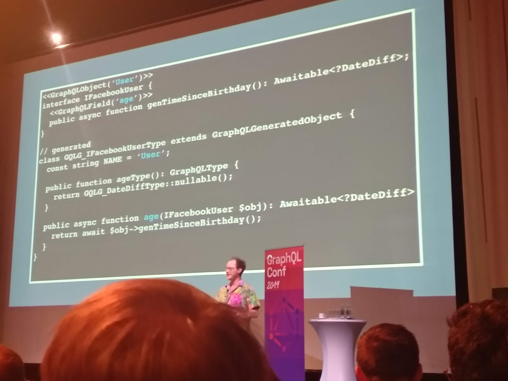

# Classy GraphQL

What if we can use classes to define object types?

Like how they do it in Facebook, as presented on GraphQL Conf. They write idiomatic code (in Hack language) with some annotations and then they generate the code that makes a GraphQL API from it:



There is the [TypeGraphQL](https://typegraphql.ml/) project that does something similar, but it relies on runtime introspection, which is limited. For example, they have to specify nullability in the type annotation and then again in the decorator.

## Object types

It should be possible to take class like this one:

```typescript
@GraphQL
class User {
  constructor(
    private context: Context,
    public firstName: string | null,
    public lastName: string | null,
    private userGroupId: string | null,
  ) {}
  
  get fullName(): string | null {
    return this.firstName && this.lastName
      ? `${this.firstName} ${this.lastName}`
      : null;
  }
  
  get userGroup(): Promise<UserGroup | null> {
    return this.context
      .dataLoaders
      .userGroups
      .load(this.userGroupId);
  }
}
```

And generate something like this:

```typescript
import { GraphQLObjectType, GraphQLString } from 'graphql';
import { GraphQLUserGroup } from './UserGroup';

export const GraphQLUser = new GraphQLObjectType({
  name: 'User',
  fields: () => ({
    firstName: {
      type: GraphQLString,
      resolve: (parent: User) => parent.firstName,
    },
    lastName: {
      type: GraphQLString,
      resolve: (parent: User) => parent.lastName,
    },
    fullName: {
      type: GraphQLString,
      resolve: (parent: User) => parent.fullName,
    },
    userGroup: {
      type: GraphQLUserGroup,
      resolve: (parent: User) => parent.userGroup,
    },
  }),
});
```

## Enums

Maybe it could generate enums from string unions:

```typescript
// written
export type Status = 'OPEN' | 'CLOSED';

// generated
export const GraphQLStatus = new GraphQLEnum({
  name: 'Status',
  values: {
    OPEN: {},
    CLOSED: {},
  },
});
```

Problem here is that decorators can't be used here, so I would have to think of a different way to tag that the type should generate a GraphQL definition.

Another way to define a GraphQL enum could be a TS enum:

```typescript
export enum Status {
  OPEN,
  CLOSED,
};
// ...
export const GraphQLStatus = new GraphQLEnum({
  name: 'Status',
  values: {
    OPEN: {
      value: 0,
    },
    CLOSED: {
      value: 1,
    },
  },
});
```

The problem with decorators remains, they can't be used on enums.

But decorators are marked as experimental and they are turned off by default, so maybe it would be better to find another approach anyway. Maybe a tag in the docblock.

## Custom scalars

Maybe this could work:

To add a custom scalar, export somewhere its `graphql-js` definition, ie. an instance of `GraphQLScalarType`. The generator will associate this GraphQL type to the `InternalType` of this instance.

Take this simplified example of `DateTime` type:

```typescript
export const GraphQLDateTime = new GraphQLScalarType<Date>({
  name: 'DateTime',
  parseValue(value) {
    return new Date(value);
  },
  serialize(value) {
    return value.toISOString();
  },
  parseLiteral(ast) {
    return new Date(ast.value);
  },
});
```

The generator now should be able to associate the `Date` type with this GraphQL type.

But there are some limitations:

- There couldn't be more GraphQL scalar types mapped to the same internal type with this approach.
- It would be problematic to use scalars defined in third-party libraries, eg. `graphql-iso-date` (this library btw uses the `Date` object as an internal type for different GraphQL types).

## Built-in scalars

Some built-in scalars are also tricky:

### `GraphQLString`, `GraphQLBoolean`

No problem here, they simply map to `string` and `boolean`

### `GraphQLInt`

This is a problem, Javascript doesn't have an integer type and usually the `number` is used for both floats and ints. Currently no perfect solution is on my mind.

Some possible solutions, I don't like neither:

- Type aliases defined by the library - `type Integer = number; type Float = number;`
- Specify the type in a decorator or in a docblock
- Keep `number` for `GraphQLFloat` only, use some custom value object class for `GraphQLInt`.

### `GraphQLID`

I guess the library could define some value object class and the generator would handle it in the generated code:

```typescript
// written
id: ID,

// generated
id: {
  type: new GraphQLNonNull(GraphQLID),
  resolve: (root: User) => root.id.toString(),
},
```

Or in the input:

```typescript
// written
get find(id: ID): User | null {
    // ...
}
// generated
find: {
  type: GraphQLUser,
  args: {
    id: new GraphQLNonNull(GraphQLID),
  },
  resolve: (root, args) => root.find(new ID(args.id)),
},
```

## Generic types

GraphQL doesn't have a support for generics, but Typescript does. Take this code:

```typescript
class Edge<Node> {
  constructor(
    public readonly node: Node,
    public readonly cursor: string,
  ) {}
}

class Connection<Node> {
  constructor(
    public readonly edges: Edge<Node>[],
    public readonly pageInfo: PageInfo,
  ) {}
}
```

GraphQL type factories could be generated from these classes:

```typescript
// Edge<Node>
export const GraphQLEdge = <Node>(GraphQLNode: GraphQLType) => {
  return new GraphQLObjectType({
    name: `${GraphQLNode.name}Edge`,
    fields: () => ({
      node: {
        type: GraphQLNode,
        resolve: (parent: Edge<Node>) => parent.node,
      },
      cursor: {
        type: GraphQLString,
        resolve: (parent: Edge<Node>) => parent.cursor,
      },
    }),
  });
};

// Connection<Node>
export const GraphQLConnection = <Node>(GraphQLNode: GraphQLType) => {
  return new GraphQLObjectType({
    name: `${GraphQLNode.name}Connection`,
    fields: () => ({
      edges: {
        type: new GraphQLList(GraphQLEdge(GraphQLNode)),
        resolve: (parent: Connection<Node>) => parent.edges,
      },
      pageInfo: {
        type: GraphQLPageInfo,
        resolve: (parent: Connection<Node>) => parent.pageInfo,
      },
    }),
  });
};
```

Now when an object declares a field as `Connection<User>`, the generator would add a field with `GraphQLConnection(GraphQLUser)`:

```typescript
// written:
get users(): Connection<User> {
  // ...
}

// generated:
{
  users: {
    type: new GraphQLNonNull(GraphQLConnection(GraphQLUser)),
    resolve: (parent: UserGroup) => parent.users,
  },
}
```
